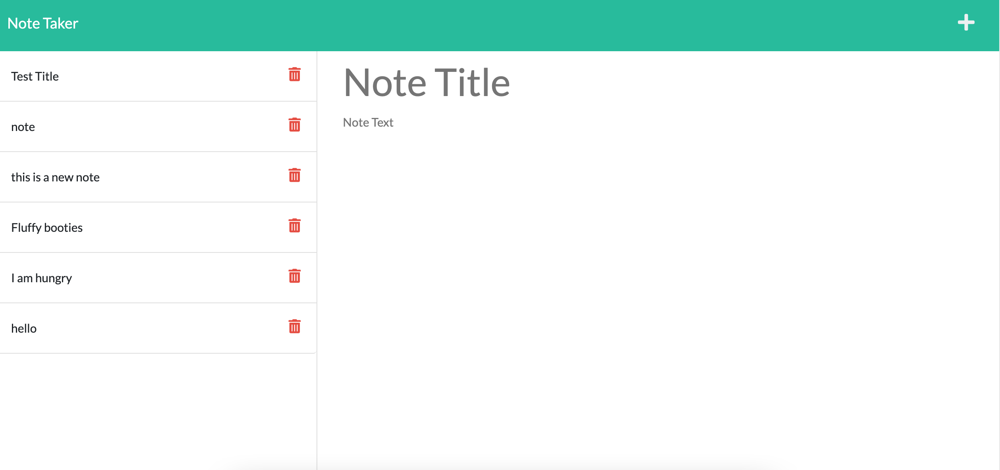

# Note-Taker-App

[](https://www.gnu.org/licenses/gpl-3.0)

## Description

- Users need a place to write down & save notes! I created an app that stores a note that the user put in on the back end and will show that data displayed on the screen to the user.

- I used an Express.js back end nad saved and retrived that note data input by the user from a JSON file. I practiced requiring in different node libraries used in this app such as path and uuid.

## Table of Contents

- [Technology-Used](#technology-used)
- [Installation](#installation)
- [Usage](#usage)
- [Contributors](#contributors)
- [License](#license)
- [Additional Questions](#additional-questions)

### Technology Used

Tech Used: Express, HTML, CSS, JavaScript, Bootstrap

### Installation

Dependencies are installed by using the following command:

```md
$ npm i
```

### Usage

[Link to deployed application on Heroku](https://kd-note-taker.herokuapp.com/)



### Contributors

**https://github.com/minnieakuma199**


### Additional Questions

**kristyndcb@gmail.com**

### License

[GNU GENERAL PUBLIC LICENSE](https://github.com/MinnieAkuma199/Note-Taker-App/blob/main/LICENSE)
